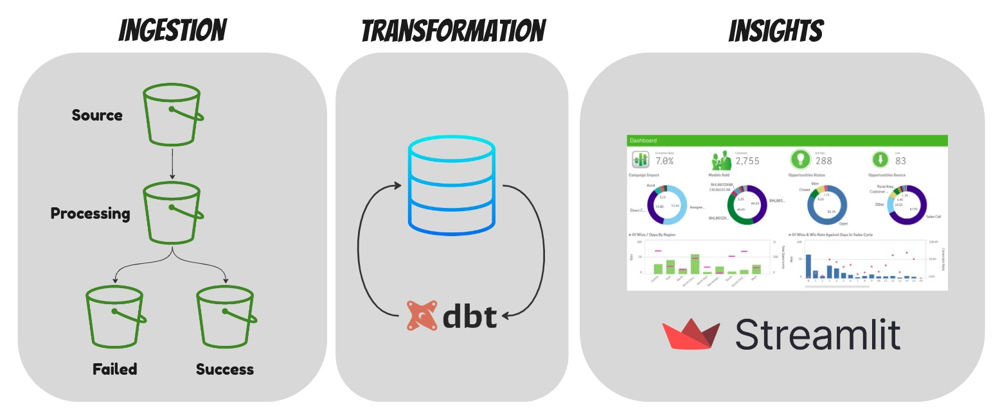

# From Data Silos to Insight: ETL, Transformation, and Reporting for Stream's B2B Growth

Project involves ETL (Extract, Transform, Load), data transformation, and reporting processes to facilitate
the growth of Stream's B2B operations.

This project mainly own 3 sections: 
1. **Ingestion**
2. **Transformation**
3. **Insight**

## Ingestion

`main.py` is responsible for picking up data, processing it and ingesting 
it into the postgres engine running on the local server. 
After files are initially put at the `Source` bucket, process picks them up 
and moves them to the `Processing` bucket. In this stage, data is ingested into 
postgres. After that, based on the execution result, the `.csv` file is either 
moved to `Success` or `Failed` bucket. 

Please refer to [start_postgres.sh](start_postgres.sh) to check up on 
how to spin up a postgres server. 

### Unit testing

To run the unit test, follow the below steps: 

1. install `pip-tools` package: `pip install pip-tools`
2. set the `PYTHONPATH` to root: `export PYTHONPATH=$PYTHONPATH:$(pwd)/src`
3. compile the `requirements.in`: `pip-compile requirements.in`
4. install `requirements.text` packages: `pip install -r requirements.txt`
5. Now you can execute the unit tests: `pytest tests/unit/test.py -s -v -q -vv --cov=utils --cov-fail-under=80 --cov-report=xml --junitxml=results.xml`

### Linting

`flake8` is a well-known package for linting in python. `isort` is used to sort imported modules.
Also `black` is added as a code formatter.
Here is how to use it: 
1. `flake8` and `pre-commit` is already included in `requirements.in` and they will be installed
2. install the pre-commit hook via `pre-commit install`
3. Run `pre-commit run --all-files`

## Transformation

**dbt** is the core player in the transformation. 
It involves with 3 layers of data process.

1. **base layer**: this the data from source or raw data
2. **staging layer**: processed data with operations like deduplication. 
3. **aggregate layer**: final aggregated data exposed to users/services/platforms

in the aggregate layer, the analytical queries rest where they will serve 
the backend of the app/dashboard. The result of the complied models will be 
stored in your postgres server. 

while running the project locally, you should 
install packages in `packages.yml` using `dbt deps`

#### Installation steps:
`sudo apt-get install libpq-dev`

`python -m pip install dbt-postgres`

#### Commands you may use for run and debug dbt
`dbt run --select items`

`dbt test -select stg_customers`: runs the tests 

`dbt debug` if you face any problem(s) with the connection

`dbt complie --select [model_name]` it complies the project into target directory

## Insight

In this section, the purpose is to execute the queries and answer to the business
questions. The following assumptions have been made:
- users with invalid name and email address are considered to be valid user
- in transactions table, subscription_id can have NULL value. I assume it's valid and means user bought service one-time off w/o getting any subscription 

Streamlit app executes a query on the designated tables to retrieve the results. 
You can install app via 
`pip install streamlit`

`app.py` containes the main source for app. 
Run `streamlit run app.py` to initiate the streamlit app and see the result as below  

